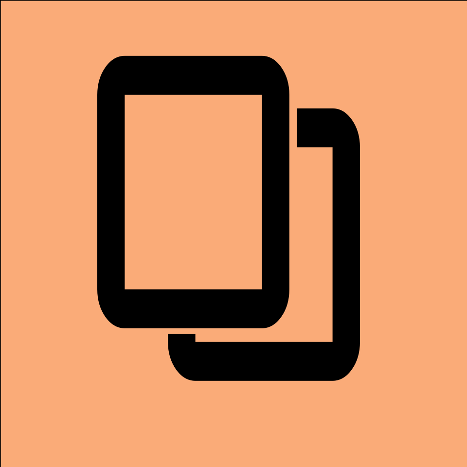

# SFV

**Super Frame Vision**

zh | [en](./README_en.md)

---

这是一个 Kotlin 多平台项目，目标平台为桌面端（JVM）。

本项目的目的是提供一个多平台的，基于 [
`FFmpeg Kit`](https://github.com/akashskypatel/ffmpeg-kit-builders)
和 [`NCNN`](https://github.com/Tencent/ncnn) 的超分插帧方案。并尽可能地提供更多的选项与好看易读的 UI。

## 支持的平台

|         | X64 | Arm64 |
|---------|:---:|:-----:|
| Windows |  ✅  |       |
| Linux   |  ✅  |       |
| MacOS   |     |   ✅   |

## 关于 AI 模型

我使用了如下 ONNX 模型生成 NCNN 模型：

[RIFE](https://huggingface.co/SOR2171/RIFE-ONNX/tree/main)

[RealESRGAN](https://huggingface.co/SceneWorks/real-esrgan-onnx/tree/main)

[RealESRGAN_x4plus_anime](https://huggingface.co/mhmtaufiq/realesrgan-onnx/tree/main)
（还没用上）

## 如何运行

* [/shared](./shared/src) 用于存放跨 Compose 多平台应用共享的代码。
  它包含以下几个子文件夹：
    - [commonMain](./shared/src/commonMain/kotlin) 用于存放所有目标平台共享的代码。
    - 其他文件夹用于存放仅编译到对应平台的 Kotlin 代码。
      例如，如果你想修改桌面端（JVM）特有的部分，[jvmMain](./shared/src/jvmMain/kotlin)
      文件夹就是合适的位置。

### 运行应用

使用 IDE 工具栏中运行控件提供的运行配置。你也可以使用以下命令和选项：

- 桌面端应用：
    - 热重载：`./gradlew :desktopApp:hotRun --auto`
    - 标准运行：`./gradlew :desktopApp:run`

### 运行测试

使用 IDE 编辑器侧边的运行按钮，或使用 Gradle 任务运行测试：

- 桌面端测试：`./gradlew :shared:jvmTest`

---

了解更多关于 [Kotlin 多平台](https://www.jetbrains.com.cn/en-us/help/kotlin-multiplatform-dev/get-started.html)…
